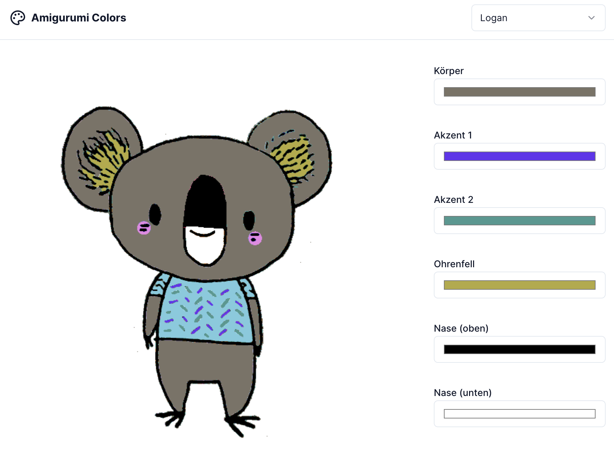

<p align="center">


# Amigurumi Colors 🎨

This repo is a NextJS app that allows the user to adjust the colors in an image by replacing them with colors from a palette. The app is designed to help my girlfriend (an amigurumi maestro) choose colors for her projects.

The code uses the Canvas API to read the image data and replace the colors. The backend is very simple. In my implementation the images are stored in [Cloudinary](https://cloudinary.com/), the database is hosted on [Retool](https://retool.com/products/database). The frontend uses [shadcn/ui](https://ui.shadcn.com/) for the UI components.

## How to use

Create a `.env` file and add the following variables:

```bash
cp .env.template .env
```

The only thing you need to do is add two API endpoints to the `.env` file.

### Database schema

The database schema is very simple. It has one table: `amigurumi_colors`. It should return the following JSON structure

```json
{
  "data": [
    {
      "project": "Zebra",
      "image": "https://res.cloudinary.com/dq7uyauun/image/upload/v1623770000/zebra.jpg",
      "colors": {
        "Body": "#ffff00",
        "Pants": "#00ff00",
        "Accents": "#0000ff"
      }
    }
  ]
}
```

- The `project` property is the name of the template.
- The `image` property is the URL of the image.
- The `colors` property is a map of the color names and the color values in hex format.

## How to run

```bash
npm install
npm run dev
```
