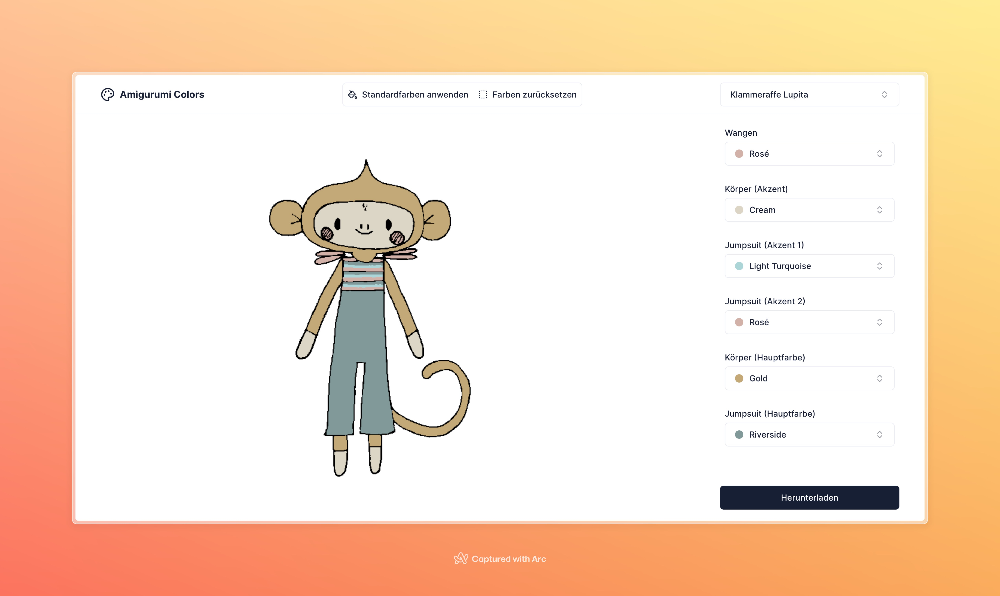

<p align="center">


# Amigurumi Colors 🎨

This repo is a NextJS app that allows the user to adjust the colors in an image by replacing them with colors from a palette. The app is designed to help my girlfriend (an amigurumi maestro) choose colors for her projects.

The code uses the Canvas API to read the image data and replace the colors. The backend is very simple. In my implementation the images are stored in [Cloudinary](https://cloudinary.com/), the database is hosted on [Retool](https://retool.com/products/database). The frontend uses [shadcn/ui](https://ui.shadcn.com/) for the UI components.

## How to use

Create a `.env` file and add the variables:

```bash
cp .env.template .env
```

### Database schema

The database schema is very simple. It has three tables: `amigurumi_colors`, `yarns`, `colours`.

The `amigurumi_colors` table contains the project metadata including the name, image url and color configuration. It should have the following JSON structure

```json
{
  "data": [
    {
      "project": "Zebra",
      "image": "https://res.cloudinary.com/.../zebra.jpg",
      "colors": {
        "Body": "#ffff00",
        "Pants": "#00ff00",
        "Accents": "#0000ff"
      }
      "default_colors": {
        "Yellow": "10",
        "Green": "301",
        "Blue": "122"
      }
    }
  ]
}
```

- The `project` property is the name of the template.
- The `image` property is the URL of the image.
- The `colors` property is a map of the color names and the color values in hex format.
- The `default_colors` property is a map of color names (which map to the hex values in the `colors` property) and the yarn IDs. The conversion of color name to hex value is done in the `templates` api route

The `yarns` table contains metadata for the available types of yarn. It should have the following JSON structure

```json
{
  "data": [
    {
      "id": 10,
      "brand": "Yarn and Colors",
      "product_line": "Must-Have"
    }
  ]
}
```

The `colours` table (excuse the inconsistent spelling) contains metadata for the available types of colors per yarn. It should have the following JSON structure

```json
{
  "data": [
    {
      "id": 4,
      "color_name": "Antique Pink",
      "color_group": "Pink",
      "hex": "#ffcccc",
      "yarn": 10
    }
  ]
}
```

## How to run

```bash
npm install
npm run dev
```
